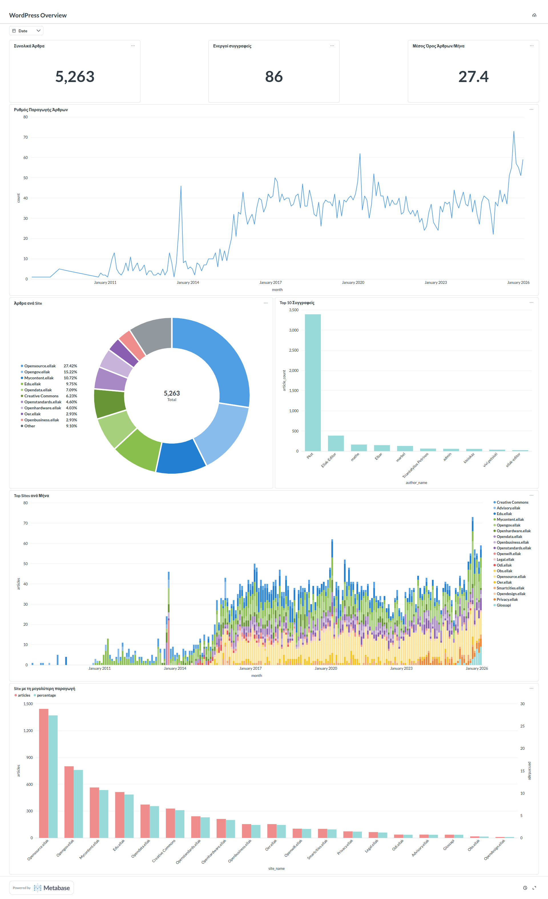

# OmniDeck: 📊 WordPress Metabase Analytics Stack

Κεντρικό σύστημα αυτοματοποιημένης συλλογής, επεξεργασίας και οπτικοποίησης δεδομένων από πολλαπλούς ιστότοπους WordPress, μέσω Docker, PostgreSQL και Metabase.

---

## 🗂️ Περιεχόμενα Αποθετηρίου

```
.
├── docker-compose.yml      # Ορισμός υπηρεσιών Docker (Metabase, PostgreSQL)
├── .env.sample             # Πρότυπο μεταβλητών περιβάλλοντος
├── sync_wp.py              # Python script συγχρονισμού από WP REST API
└── README.md               # Το παρόν αρχείο
└── SystemAnalysis.md       # Ανάλυση Συστήματος
```

---

## 🏗️ Αρχιτεκτονική

Το stack αποτελείται από τρία κύρια συστατικά:

- **Metabase** — Πλατφόρμα Business Intelligence για τη δημιουργία dashboards και αναλύσεων.
- **PostgreSQL** — Σχεσιακή βάση δεδομένων για την αποθήκευση των άρθρων και κατηγοριών από όλους τους ιστότοπους.
- **Caddy** *(προαιρετικό, δεν συμπεριλαμβάνεται στο compose)* — Reverse proxy για διαχείριση SSL και εξωτερικής πρόσβασης.

Το `sync_wp.py` εκτελείται στον host (μέσω cron) και ανακτά δεδομένα από το WP REST API, αποθηκεύοντάς τα στην PostgreSQL με λογική **upsert** ώστε να μην δημιουργούνται διπλότυπα.

---

## ✅ Προαπαιτούμενα

Πριν ξεκινήσεις, βεβαιώσου ότι το σύστημά σου διαθέτει:

| Απαίτηση | Έκδοση / Σημείωση |
|---|---|
| Λειτουργικό Σύστημα | Linux (Ubuntu 22.04 LTS ή νεότερο) |
| Docker | Τελευταία σταθερή έκδοση |
| Docker Compose | v2+ |
| Python | 3.10+ (στον host) |
| Ανοιχτές θύρες | 80 (HTTP), 443 (HTTPS), 5432 (PostgreSQL - μόνο τοπικά) |
| Δικαιώματα | `root` ή `sudo` |

### Εγκατάσταση Python βιβλιοθηκών

```bash
pip install requests pandas sqlalchemy psycopg2-binary
```

---

## 🚀 Οδηγός Εγκατάστασης

### Βήμα 1 — Δομή Καταλόγων

Δημιούργησε την απαραίτητη δομή αρχείων:

```bash
mkdir -p /docker/metabase/postgres-data
mkdir -p /docker/caddy
mkdir -p /docker/scripts

# Σωστή ιδιοκτησία για τον PostgreSQL container (UID 999)
sudo chown -R 999:999 /docker/metabase/postgres-data
```

### Βήμα 2 — Ρύθμιση Μεταβλητών Περιβάλλοντος

Αντέγραψε το αρχείο-πρότυπο και συμπλήρωσε τις τιμές:

```bash
cp .env.sample /docker/metabase/.env
nano /docker/metabase/.env
```

Το αρχείο `.env` πρέπει να περιέχει:

```dotenv
POSTGRES_DB=metabase_db
POSTGRES_USER=metabase_admin
POSTGRES_PASSWORD=<ΙΣΧΥΡΟΣ_ΚΩΔΙΚΟΣ>
MB_DB_PASS=<ΙΣΧΥΡΟΣ_ΚΩΔΙΚΟΣ>
MY_DOMAIN=<ΤΟ_DOMAIN_ΣΟΥ>
```

> ⚠️ **Σημαντικό:** Κλείδωσε το αρχείο για να αποτρέψεις μη εξουσιοδοτημένη ανάγνωση:
> ```bash
> chmod 600 /docker/metabase/.env
> ```

### Βήμα 3 — Δημιουργία Docker Network

```bash
docker network create web
```

### Βήμα 4 — Εκκίνηση Υπηρεσιών

Αντέγραψε το `docker-compose.yml` στο `/docker/metabase/` και εκκίνησε το stack:

```bash
cp docker-compose.yml /docker/metabase/docker-compose.yml
cd /docker/metabase
docker compose up -d
```

Επαλήθευσε ότι τα containers τρέχουν:

```bash
docker ps
```

Και οι δύο υπηρεσίες (`metabase` και `metabase-db`) πρέπει να έχουν κατάσταση **Up**.

Παρακολούθηση logs κατά την εκκίνηση:

```bash
docker logs -f metabase
```

Αναζήτησε το μήνυμα `Metabase Initialization COMPLETE` για να επιβεβαιώσεις την επιτυχή εκκίνηση.

### Βήμα 5 — Τοποθέτηση του Python Script

```bash
cp sync_wp.py /docker/scripts/sync_wp.py
```

Άνοιξε το αρχείο και συμπλήρωσε τα στοιχεία σύνδεσης στη βάση:

```bash
nano /docker/scripts/sync_wp.py
```

Βρες και ενημέρωσε τις παρακάτω γραμμές:

```python
DB_USER = "metabase_admin"
DB_PASS = "ΟΙ_ΚΩΔΙΚΟΣ_ΣΟΥ"  # ίδιος με το .env
DB_HOST = "localhost"
DB_PORT = "5432"
DB_NAME = "metabase_db"
```

Επίσης, ενημέρωσε τη λίστα `SITES` με τους ιστότοπους WordPress που θέλεις να παρακολουθείς.

### Βήμα 6 — Δοκιμαστική Εκτέλεση

```bash
python3 /docker/scripts/sync_wp.py
```

Επιτυχής εκτέλεση εμφανίζει:

```
✅ Επιτυχής ενημέρωση! Συνολικά μοναδικά άρθρα στη βάση: XXXX
```

### Βήμα 7 — Αυτοματοποίηση με Cron

Άνοιξε τον crontab:

```bash
crontab -e
```

Πρόσθεσε την παρακάτω γραμμή για ημερήσια εκτέλεση στις 03:00:

```cron
# Συγχρονισμός άρθρων WordPress κάθε βράδυ στις 3πμ
0 3 * * * /usr/bin/python3 /docker/scripts/sync_wp.py >> /docker/scripts/sync_wp.log 2>&1
```

> **Εναλλακτικά**, για εκτέλεση κάθε ώρα:
> ```cron
> 0 * * * * /usr/bin/python3 /docker/scripts/sync_wp.py >> /docker/scripts/sync_wp.log 2>&1
> ```

---

## 🖥️ Ρύθμιση Metabase

### Σύνδεση με τη Βάση Δεδομένων

1. Άνοιξε το Metabase στο browser: `https://<ΤΟ_DOMAIN_ΣΟΥ>`
2. Μεταβαίνε στο: **Admin Settings → Databases → Add database**
3. Συμπλήρωσε:

   | Πεδίο | Τιμή |
   |---|---|
   | Database type | PostgreSQL |
   | Name | WordPress Analytics |
   | Host | `metabase-db` *(εσωτερικό Docker όνομα)* |
   | Port | `5432` |
   | Database name | `metabase_db` |
   | Username | `metabase_admin` |
   | Password | *(ο κωδικός από το .env)* |

4. Πάτα **Save**.

> 📌 Μετά από κάθε εκτέλεση του `sync_wp.py`, αν εμφανιστούν νέοι πίνακες, εκτέλεσε χειροκίνητο sync: **Admin → Databases → Sync database schema now**.

### Δημιουργία Dashboard

1. Πάτα **+ New → Dashboard**, δώσε όνομα `WordPress Overview` και πάτα **Create**.
2. Πρόσθεσε ερωτήματα (questions) μέσω **+ → Native query (SQL)**.

#### Χρήσιμα SQL Queries

**Άρθρα ανά ιστότοπο (Pie Chart):**
```sql
SELECT site_name, count(*) as total_articles
FROM all_articles
WHERE {{date_filter}}
GROUP BY site_name
```

**Top 10 Συγγραφείς (Bar Chart):**
```sql
SELECT author_name, count(*) as article_count
FROM all_articles
WHERE author_name != 'Unknown' AND {{date_filter}}
GROUP BY author_name
ORDER BY article_count DESC
LIMIT 10
```

**Ρυθμός δημοσίευσης ανά μήνα (Line Chart):**
```sql
SELECT date_trunc('month', date) as month, count(*) as count
FROM all_articles
WHERE {{date_filter}}
GROUP BY month
ORDER BY month ASC
```

**Top 15 Κατηγορίες (JSONB Join):**
```sql
SELECT c.cat_name, count(*) as total
FROM all_articles a
CROSS JOIN LATERAL jsonb_array_elements_text(a.categories) as cat_id_text
JOIN categories c ON c.cat_id = cat_id_text::int AND c.site_name = a.site_name
WHERE {{date_filter}}
GROUP BY c.cat_name
ORDER BY total DESC
LIMIT 15
```

> Για κάθε query, ρύθμισε τη μεταβλητή `date_filter` ως εξής:
> - **Variable Type:** Field Filter
> - **Field to map:** `all_articles → date`
> - **Widget type:** Date Range

### Καθολικό Φίλτρο Ημερομηνίας

1. Στο Dashboard, πάτα **Edit**.
2. **Add Filter → Time → Date Range**.
3. Σύνδεσε το φίλτρο με κάθε κάρτα επιλέγοντας τη μεταβλητή `date_filter`.

### Σύνδεση Φίλτρου στα Γραφήματα (Mapping)

Ακόμα και αν το query είναι σωστό, πρέπει να ενημερώσεις το Dashboard ποια μεταβλητή κάθε κάρτας αντιστοιχεί στο φίλτρο ημερομηνίας.

1. Στο Dashboard, πάτα το **μολυβάκι (Edit)** πάνω δεξιά.
2. Πάτα πάνω στο φίλτρο ημερομηνίας που μόλις πρόσθεσες.
3. Θα εμφανιστούν drop-down μενού πάνω από **κάθε γράφημα**.
4. Σε κάθε γράφημα, επίλεξε τη μεταβλητή `date_filter` (ή όπως την ονόμασες στο SQL).

> ⚠️ Αν το drop-down είναι κενό σε κάποιο γράφημα, σημαίνει ότι η μεταβλητή στο αντίστοιχο query **δεν έχει οριστεί ως `Field Filter`**. Επέστρεψε στο query και βεβαιώσου ότι ο τύπος της μεταβλητής είναι `Field Filter` με `Field to map: all_articles → date`.

5. Πάτα **Done** και μετά **Save**.

---

## 🔍 Επαλήθευση Λειτουργίας

| Έλεγχος | Εντολή / Ενέργεια |
|---|---|
| Κατάσταση containers | `docker ps` → Αναμενόμενο: **Up** |
| Logs Metabase | `docker logs -f metabase` → Αναζήτηση: `Initialization COMPLETE` |
| Σύνδεση βάσης | Admin → Databases → έλεγχος σύνδεσης |
| Επιτυχία script | `python3 sync_wp.py` → Εμφάνιση ✅ μηνύματος |
| Log αρχείο cron | `tail -f /docker/scripts/sync_wp.log` |

---

## 🛠️ Αντιμετώπιση Προβλημάτων

| Σφάλμα | Αιτία | Λύση |
|---|---|---|
| `FATAL: password authentication failed` | Υπάρχοντα δεδομένα στο `postgres-data` με παλαιό κωδικό | Διαγραφή του `postgres-data` και επανεκκίνηση: `docker compose down && rm -rf postgres-data && docker compose up -d` |
| `CardinalityViolation` | Διπλότυπα `wp_id` λόγω API pagination overlap | Χρήση `df.drop_duplicates(subset=['wp_id'])` πριν το SQL insertion (ήδη υλοποιημένο) |
| `Invalid syntax for type json` | Εσφαλμένο format λίστας κατηγοριών | Χρήση `json.dumps()` για μετατροπή λιστών σε JSON strings |
| `Table all_articles not found` στο Metabase | Το Metabase δεν έχει κάνει sync το σχήμα | **Admin → Databases → Sync database schema now** |
| Γραφήματα δεν ανανεώνονται | Caching Metabase | **Admin → Databases → Discard saved field values and scan now** |
| `Table not found` στον SQL editor | Επιλεγμένη η Sample Database αντί της WordPress Analytics | Άλλαξε τη βάση από το dropdown πάνω αριστερά στον editor |

---

## 📤 Διαμοιρασμός Δεδομένων

Το Metabase προσφέρει τρεις τρόπους κοινοποίησης:

- **Public Links:** Admin Settings → Public Sharing → Προβολή χωρίς login.
- **Embedding:** Ενσωμάτωση γραφημάτων σε εξωτερικά portals μέσω `<iframe>`.
- **Subscriptions:** Αυτόματη αποστολή αναφορών σε Email ή Slack (απαιτεί ρύθμιση SMTP).

---

## 💡 Best Practices

1. **Εξωτερική PostgreSQL:** Η χρήση PostgreSQL αντί της ενσωματωμένης H2 βάσης του Metabase εξασφαλίζει σταθερότητα και εύκολα backups.
2. **Upsert Strategy:** Η εντολή `ON CONFLICT` επιτρέπει συχνό συγχρονισμό χωρίς διπλότυπα ή πλήρη διαγραφή πινάκων.
3. **JSONB Storage:** Η αποθήκευση κατηγοριών ως JSONB επιτρέπει ευέλικτα φίλτρα χωρίς σύνθετα Many-to-Many schemas.
4. **Ασφάλεια Δικτύου:** Η θύρα 5432 πρέπει να είναι προσβάσιμη **μόνο τοπικά** (localhost). Χρησιμοποίησε firewall κανόνες για να αποκλείσεις εξωτερική πρόσβαση.
5. **Παρακολούθηση Logs:** Έλεγχε τακτικά το `/docker/scripts/sync_wp.log` για τυχόν σφάλματα επικοινωνίας με τα WP APIs.

---

## Screenshot



---

## 📄 Άδεια Χρήσης

Διανέμεται υπό τους όρους της άδειας που ορίζεται στο αρχείο `LICENSE` του αποθετηρίου.